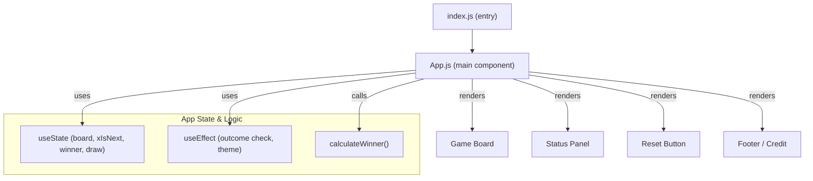

# Tic Tac Toe Frontend Architecture

This document describes the architecture, primary modules, and general structure of the _tic_tac_toe_frontend_ React application. This web application implements a minimal, responsive, and interactive tic-tac-toe game for two players.

## Overview

The application is composed as a single-page React app, using exclusively function components and React hooks for state management. All game logic, state, and view rendering are contained in one main component—`App.js`.

The application entry is defined by `src/index.js`, which renders the `App` component into the root DOM node.

---

## Main Modules

### 1. Application Entry (`src/index.js`)

- Imports React, ReactDOM, global styles, and the root `App` component.
- Uses `ReactDOM.createRoot` to attach the React tree to the DOM.
- Wraps the main `App` component in `React.StrictMode` for highlighting potential issues in development mode.

**Flow:**
1. Import dependencies.
2. Find the `root` DOM node.
3. Create a root and render `<App />`.

### 2. Game/App Logic (`src/App.js`)

- Implements all UI and logic for the game, including the board rendering, player state, win/draw detection, and resetting the game.
- Uses four state variables:
    - `board`: array of 9 values (`'X'`, `'O'`, or `null`) representing the grid.
    - `xIsNext`: boolean, representing if it's X’s turn.
    - `winner`: `null`, `'X'`, or `'O'` for the game's outcome.
    - `draw`: boolean, true if the board is full and no winner.
- Handles player moves, updates the game state, detects wins/draws, provides status messages, and allows the game to be reset.
- Renders a simple UI with pastel colors and a pleasant modern theme, defined largely in `App.css`.

---

## Code Structure and React Patterns

- The app is organized primarily as a single root functional component: `App`.
- Uses React state and effects via hooks for all interactive aspects.
- Logic for determining win conditions is delegated to a helper function `calculateWinner`.
- UI is declaratively rendered using `.map()` for rows and columns.
- All styling is handled with local CSS files (no UI frameworks).

---

## Mermaid Diagram

A high-level diagram summarizing structure and data flow in the frontend app:

---

## Styling

- The application's visual design uses a "Soft Cotton Candy Pastel Palette" implemented in `src/App.css`.
- The CSS defines both layout (`.ttt-container`) and UI elements such as squares, status, reset button, and responsive tweaks for mobile.

---

## Summary

This project follows a highly modular, minimal, and understandable architecture, typical for small-scale modern React apps. All gameplay logic and presentation sit together in a root component, offering a quick path for customization or further extension.

## References

- `src/App.js` — Game logic and main UI.
- `src/index.js` — App entry point/rendering.
- `src/App.css`, `src/index.css` — All styling rules.

